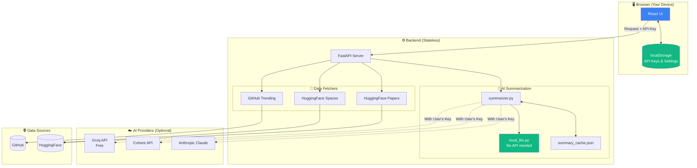

# 🤖 YUV.AI Developers AI Trends

> **Your personal AI news assistant - get the latest AI/ML trends with smart summaries, no API key required!**

A privacy-first news aggregator that fetches trending AI content from GitHub and Hugging Face, then explains what each project does using AI. Works out-of-the-box with a built-in local summarizer, or connect your favorite AI provider for enhanced summaries.

**🔒 Privacy First**: All your settings and API keys are stored locally in your browser - never on any server!


---

## 📋 Release Notes (v2.1.0 - Production Ready)

### 🆕 What's New

- **🔒 Browser-Based Storage** - API keys stored in localStorage, never on server
- **No Database Required** - Fully stateless backend, perfect for serverless
- **No API Key Required!** - `local_wasm` mode generates summaries without any external API
- **4 AI Providers** - Choose from Local, Groq (free), Cohere, or Anthropic Claude
- **Smart Caching** - Summaries cached locally, auto-cleans invalid entries
- **Production Ready** - Deploy to Vercel + Railway with zero config

### 🏗️ Architecture Changes

- API keys sent per-request from browser (not stored on server)
- Removed server-side settings management
- Added `/api/validate-key` endpoint for key verification
- Frontend uses localStorage for all user preferences

---

## 📸 Screenshots

### Main Interface


### Settings (Privacy-First)


---

## 🏗️ Architecture



**Key Privacy Feature**: Your API keys never leave your browser except when making AI requests directly to the provider you choose.

---

## 🚀 Quick Start (5 Minutes)

### Prerequisites
- Python 3.8+ 
- Node.js 18+
- Git

### Step 1: Clone and Install

```bash
# Clone the repository
git clone https://github.com/hoodini/yuv-ai-trends.git
cd yuv-ai-trends

# Create Python virtual environment
python -m venv .venv

# Activate it (Windows)
.\.venv\Scripts\Activate.ps1

# Install Python dependencies
pip install -r requirements.txt

# Install frontend dependencies
cd ui
npm install
cd ..
```

### Step 2: Start the App

**Option A: One-click (Windows)**
```powershell
.\start_app.ps1
```

**Option B: Manual**
```bash
# Terminal 1 - Backend
python api.py

# Terminal 2 - Frontend
cd ui
npm run dev
```

### Step 3: Open and Use

1. Open http://localhost:5173
2. Click **"Generate"** to fetch AI news
3. It works immediately with Local Web LLM!
4. (Optional) Go to **Settings** to add your own API keys

---

## ⚙️ AI Provider Options

| Provider | Cost | Speed | Quality | API Key Required |
|----------|------|-------|---------|------------------|
| **Local Web LLM** | Free | Fast | Good | ❌ No |
| **Groq** | Free tier | Very Fast | Great | ✅ Yes |
| **Cohere** | Free tier | Fast | Great | ✅ Yes |
| **Anthropic** | Paid | Medium | Excellent | ✅ Yes |

### Get Free API Keys

- **Groq** (Recommended): https://console.groq.com/keys
- **Cohere**: https://dashboard.cohere.com/api-keys
- **Anthropic**: https://console.anthropic.com/settings/keys

---

## 🌐 Deploy to Production

### Deploy to Vercel + Railway (Free)

This app is designed for split deployment:
- **Frontend** → Vercel (static hosting)
- **Backend** → Railway (Python server)

#### Step 1: Deploy Backend to Railway

1. Go to [railway.app/new](https://railway.app/new)
2. Click "Deploy from GitHub repo"
3. Select your forked repo
4. Railway auto-detects Python
5. Copy your Railway URL (e.g., `https://your-app.up.railway.app`)

#### Step 2: Deploy Frontend to Vercel

1. Go to [vercel.com/new](https://vercel.com/new)
2. Import your GitHub repo
3. Configure:
   - **Root Directory**: `ui`
   - **Framework Preset**: Vite
   - **Build Command**: `npm run build`
   - **Output Directory**: `dist`
4. Add Environment Variable:
   - `VITE_API_URL` = `https://your-app.up.railway.app`
5. Deploy!

#### Vercel Settings Summary

| Setting | Value |
|---------|-------|
| Root Directory | `ui` |
| Framework | Vite |
| Build Command | `npm run build` |
| Output Directory | `dist` |
| Node.js Version | 18.x |

| Environment Variable | Value |
|---------------------|-------|
| `VITE_API_URL` | Your Railway backend URL |

That's it! Your app is now live. Users can:
1. Use Local Web LLM (no API key needed)
2. Add their own API keys in Settings (stored in their browser)

---

## 🔒 Privacy & Security

### How API Keys Are Handled

1. **Storage**: Keys stored in browser's `localStorage` only
2. **Transmission**: Keys sent only when making AI requests
3. **Server**: Backend is stateless - no keys stored server-side
4. **Validation**: Keys validated via `/api/validate-key` endpoint

### What Data is Collected

- **Nothing!** This app collects no user data
- No analytics, no tracking, no cookies
- Summary cache is stored locally on your machine

---

## 🛠️ API Reference

### `POST /api/generate`
Generate AI news digest with summaries.

```json
{
  "time_range": "daily",
  "limit": 50,
  "disable_ai": false,
  "llm_provider": "local_wasm",
  "llm_model": "",
  "api_key": null
}
```

### `POST /api/validate-key`
Validate an API key without storing it.

```json
{
  "provider": "groq",
  "api_key": "gsk_..."
}
```

### `GET /api/settings`
Get available providers and models.

### `POST /api/populate-summaries`
Populate AI summaries for items.

```json
{
  "items": [...],
  "force_refresh": false,
  "llm_provider": "groq",
  "api_key": "gsk_..."
}
```

---

## 📁 Project Structure

```
yuv-ai-trends/
├── api.py              # FastAPI backend (stateless)
├── summarizer.py       # AI summary generation
├── local_llm.py        # Built-in summarizer (no API)
├── cache_manager.py    # Summary caching
├── fetchers.py         # GitHub & HuggingFace scrapers
├── ranker.py           # Content scoring
├── config.py           # Configuration
├── requirements.txt    # Python dependencies
├── Procfile            # Railway deployment
├── railway.json        # Railway config
├── vercel.json         # Vercel config
└── ui/                 # React frontend
    ├── src/
    │   ├── App.jsx     # Main app (uses localStorage)
    │   └── components/
    │       └── Settings.jsx  # localStorage-based settings
    ├── package.json
    └── .env.production # Production API URL
```

---

## 🐛 Troubleshooting

### "Failed to connect to neural network"
- Make sure backend is running: `python api.py`
- Check it's on port 8000: http://localhost:8000/api/settings

### "API key invalid"
- Go to Settings → API Keys
- Make sure you copied the full key
- Try the "Validate & Save" button

### Summaries show "Details not available"
- This happens for items without descriptions
- Local LLM does its best with available info
- Try a different AI provider for better results

### CORS errors in production
- Make sure `VITE_API_URL` is set correctly in Vercel
- Backend should allow your Vercel domain (uses `*` by default)

---

## 🤝 Contributing

1. Fork the repository
2. Create a feature branch
3. Make your changes
4. Submit a pull request

---

## 📝 License

MIT License - use it however you want!

---

## 👤 Author

**Yuval Avidani** - [YUV.AI](https://yuv.ai)

---

**Made with ❤️ for the AI/ML community**
