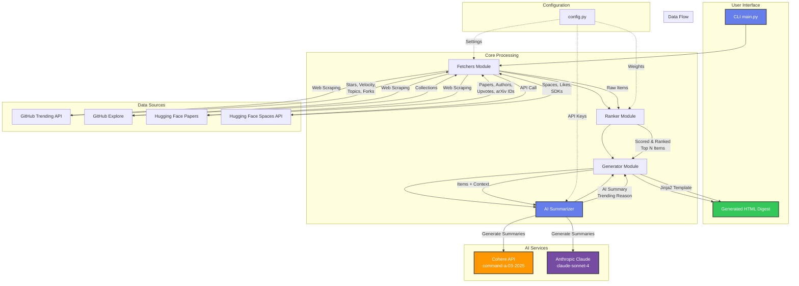

# 🤖 YUV.AI Developers AI Trends

> **Stay ahead of the curve with curated Gen AI & Machine Learning trends, delivered in a beautiful digest with AI-powered summaries.**

A personalized news aggregator that fetches, ranks, and presents the latest trending content from the AI/ML ecosystem in a stunning, Apple Newsroom-inspired layout. Now featuring AI-generated summaries and trending explanations powered by Cohere or Anthropic Claude.

## 📸 Screenshots

### Main Interface with Top 5 Highlights


### Content Filtering Tabs


### Filtered View (Code Repos)


---


---

## 🏗️ System Architecture



### Data Flow Steps

1. **CLI Invocation** → User runs `python main.py` with options
2. **Fetchers** → Parallel collection from multiple sources:
   - GitHub Trending (web scraping)
   - Hugging Face Papers (web scraping)
   - Hugging Face Spaces (official API)
   - GitHub Explore Collections (web scraping)
3. **Ranker** → Scores items based on:
   - Popularity metrics (40%)
   - Growth velocity (30%)
   - Recency (30%)
4. **Generator** → Takes top N ranked items
5. **AI Summarizer** → For each item:
   - Builds context from metadata
   - Calls Cohere or Anthropic API
   - Generates concise summary
   - Explains trending reasons
6. **Template Rendering** → Jinja2 renders HTML with enriched data
7. **Output** → Beautiful HTML digest with AI summaries & copy buttons

---

## ✨ Features

### 📊 **Multi-Source Aggregation**
- 🔥 **GitHub Trending** - Hottest repos with star velocity tracking
- 📄 **Hugging Face Papers** - Latest research from arXiv & HF Daily Papers
- 🚀 **Hugging Face Spaces** - Trending interactive ML demos
- 📦 **GitHub Explore** - Curated collections (coming soon)

### 🎨 **Beautiful Design**
- Clean, modern card-based layout inspired by Apple Newsroom
- Responsive design that works on all devices
- Smart typography and spacing
- Smooth animations and hover effects

### 🎯 **Smart Ranking**
- Popularity metrics (stars, likes, upvotes)
- Growth velocity (stars/day)
- Real-time trending indicators
- Topic categorization and tags

### 🤖 **AI-Powered Insights** ✨ NEW!
- Automatic one-sentence summaries for each item
- AI-generated trending explanations
- Powered by Cohere or Anthropic Claude
- Grounded in real metrics and descriptions
- One-click copy to clipboard

### ⚙️ **Flexible & Customizable**
- Multiple time ranges: daily, weekly, monthly, or custom
- Configurable sources and filters
- Language-specific trending (Python, TypeScript, Jupyter, etc.)
- Easy branding customization
- Optional AI summaries (can be disabled)

### 🤖 **Automation Ready**
- CLI interface for easy scripting
- Supports Windows Task Scheduler, cron, GitHub Actions
- One-command digest generation
- Optional auto-open in browser

---

## 🚀 Quick Start

### Prerequisites
- Python 3.8 or higher
- pip package manager
- (Optional) Cohere or Anthropic API key for AI summaries

### Installation

1. **Clone the repository**
```bash
git clone https://github.com/hoodini/yuv-ai-trends.git
cd yuv-ai-trends
```

2. **Install dependencies**
```bash
pip install -r requirements.txt
```

3. **(Optional) Set up AI API key**
```bash
# For Cohere (recommended - faster)
export COHERE_API_KEY="your-api-key-here"

# OR for Anthropic Claude
export ANTHROPIC_API_KEY="your-api-key-here"

# Get your free API key:
# Cohere: https://dashboard.cohere.com/api-keys
# Anthropic: https://console.anthropic.com/
```

4. **Generate your first digest**
```bash
# With AI summaries (if API key is set)
python main.py --range daily --open

# Without AI summaries
python main.py --range daily --open --no-ai
```

That's it! Your browser will open with today's AI trends digest. 🎉

---

## 📖 Usage

### Basic Commands

```bash
# Daily digest (default)
python main.py --range daily

# Weekly digest
python main.py --range weekly

# Monthly digest
python main.py --range monthly

# Custom date range (14 days)
python main.py --days 14

# Limit number of items
python main.py --range daily --limit 30

# Auto-open in browser
python main.py --range daily --open

# Custom output filename
python main.py --range daily --output my_digest.html
```

### Command-Line Options

| Option | Description | Example |
|--------|-------------|---------|
| `--range` | Time range: daily, weekly, monthly | `--range weekly` |
| `--days` | Custom number of days | `--days 7` |
| `--limit` | Max items in digest | `--limit 50` |
| `--open` | Open in browser after generation | `--open` |
| `--output` | Custom output filename | `--output weekly.html` |
| `--no-ai` | Disable AI-powered summaries | `--no-ai` |

---

## ⚙️ Configuration

Edit `config.py` to customize your digest:

```python
# GitHub settings
GITHUB_LANGUAGES = ["python", "jupyter-notebook", "typescript"]
GITHUB_TOPICS = ["machine-learning", "deep-learning", "llm", "generative-ai"]

# Hugging Face settings
HF_SPACES_TRENDING_LIMIT = 20

# Scoring weights (adjust to your preference)
SCORING_WEIGHTS = {
    "stars_weight": 0.4,      # GitHub stars importance
    "recency_weight": 0.3,    # How recent matters
    "velocity_weight": 0.3,   # Growth rate importance
}

# AI Summarization settings
AI_SUMMARIES_ENABLED = True  # Set to False to disable globally
AI_MAX_WORKERS = 3  # Parallel API calls (lower for rate limits)
```

### API Key Setup

Create a `.env` file or set environment variables:

```bash
# Option 1: Cohere (recommended - faster, generous free tier)
COHERE_API_KEY=your_cohere_key_here

# Option 2: Anthropic Claude (more detailed summaries)
ANTHROPIC_API_KEY=your_anthropic_key_here
```

The system will auto-detect which API key is available and use it.

---

## 🤖 Automation

### Windows (Task Scheduler)

**PowerShell command:**
```powershell
$action = New-ScheduledTaskAction -Execute "python" -Argument "C:\path\to\news\main.py --range daily --open"
$trigger = New-ScheduledTaskTrigger -Daily -At 8am
Register-ScheduledTask -Action $action -Trigger $trigger -TaskName "AITrendsDaily"
```

### Linux/Mac (Cron)

```bash
# Edit crontab
crontab -e

# Add this line for daily 8am execution
0 8 * * * cd /path/to/news && python main.py --range daily
```

### GitHub Actions

Create `.github/workflows/daily-digest.yml`:

```yaml
name: Daily AI Trends
on:
  schedule:
    - cron: '0 8 * * *'  # 8am UTC daily
jobs:
  generate:
    runs-on: ubuntu-latest
    steps:
      - uses: actions/checkout@v3
      - uses: actions/setup-python@v4
        with:
          python-version: '3.10'
      - run: pip install -r requirements.txt
      - run: python main.py --range daily
```

See `AUTOMATION.md` for more detailed automation options.

---

## 📁 Project Structure

```
yuv-ai-trends/
├── main.py              # CLI entry point & orchestration
├── config.py            # Configuration settings
├── fetchers.py          # Data collection from sources
├── ranker.py            # Scoring & ranking algorithms
├── generator.py         # HTML digest generation
├── summarizer.py        # 🆕 AI-powered summaries (Cohere/Anthropic)
├── hf_mcp.py           # Hugging Face MCP integration
├── templates/
│   └── digest.html      # Beautiful HTML template w/ AI sections
├── output/              # Generated digests
├── requirements.txt     # Python dependencies
├── .env.example        # API key template
├── README.md           # You are here!
└── AUTOMATION.md       # Automation guides
```

---

## 🎨 Customization

### Branding

Edit `templates/digest.html` header section to customize branding:

```html
<header>
    <div>
        <strong>Your Name</strong> • Your Title • <a href="https://yoursite.com">YourSite</a>
    </div>
    <h1>🤖 Your AI Trends Title</h1>
</header>
```

### Styling

The template uses clean, modern CSS. Key classes to customize:

- `.item` - Card styling
- `.item-title` - Title appearance
- `.section-title` - Section headers
- `header` - Top banner gradient

---

## 🔧 Technical Details

### Data Sources

1. **GitHub Trending**: Web scraping with BeautifulSoup
2. **Hugging Face Papers**: HF Papers page scraping + arXiv metadata
3. **Hugging Face Spaces**: Official HF Hub API
4. **GitHub Explore**: Web scraping (limited availability)

### Ranking Algorithm

Items are scored based on:
- **Popularity**: Stars, likes, upvotes (40%)
- **Velocity**: Recent growth rate (30%)
- **Recency**: How recent the item is (30%)

Scores are normalized to 0-100 and items are sorted accordingly.

### Technologies

- **Python 3.8+**: Core language
- **Requests**: HTTP client
- **BeautifulSoup4**: HTML parsing
- **Hugging Face Hub**: Official API client
- **Jinja2**: HTML templating
- **Click**: CLI interface
- **Cohere SDK**: AI summary generation (primary)
- **Anthropic SDK**: Alternative AI provider
- **Concurrent Futures**: Parallel API calls

---

## 🤝 Contributing

Contributions are welcome! Here are some ways you can help:

- 🐛 Report bugs and issues
- 💡 Suggest new features or data sources
- 🎨 Improve the design/layout
- 📖 Improve documentation
- 🔧 Submit pull requests

### Development Setup

```bash
# Fork and clone the repo
git clone https://github.com/yourusername/yuv-ai-trends.git

# Create a virtual environment
python -m venv .venv
source .venv/bin/activate  # or .venv\Scripts\activate on Windows

# Install dependencies
pip install -r requirements.txt

# Make your changes and test
python main.py --range daily --open
```

---

## 📝 License

MIT License - feel free to use this project for personal or commercial purposes.

---

## 👤 Author

**Yuval Avidani**
- 🌐 Website: [YUV.AI](https://yuv.ai)
- 💼 AI Builder & Speaker
- 🚀 Passionate about democratizing AI knowledge

---

## 🙏 Acknowledgments

- GitHub for trending data
- Hugging Face for Papers and Spaces API
- The amazing open-source AI/ML community

---

## 📊 Sample Output

The digest includes:
- **Total Items**: Count of all trending content
- **GitHub Repos**: With stars, velocity, topics, forks, contributors
- **Papers**: With authors, arXiv IDs, upvotes, publication dates
- **Spaces**: With likes, SDKs, creation dates
- **✨ AI Summaries**: One-sentence description of what each item does
- **🔥 Trending Explanations**: Why it's trending and what's innovative
- **📋 Copy Buttons**: One-click copy summary to clipboard

All organized in a beautiful, clickable layout with smooth scrolling and responsive design.

### AI Summary Example

**Project**: UniVA: Universal Video Agent  
**✨ AI Summary**: UniVA is an open-source, generalist AI agent designed to perform diverse video-related tasks universally.  
**🔥 Why Trending**: UniVA is trending due to its groundbreaking ability to handle a wide range of video tasks—from editing and summarization to generation—with a single model, democratizing advanced video AI through open-source accessibility.

---

## 🔮 Roadmap

- [x] AI-powered summaries (✅ Completed!)
- [x] Multiple AI provider support (✅ Cohere + Anthropic)
- [x] Copy to clipboard functionality (✅ Completed!)
- [ ] Add more data sources (Papers with Code, Reddit, Twitter)
- [ ] Email digest delivery
- [ ] RSS feed generation
- [ ] User accounts and preferences
- [ ] Mobile app
- [ ] Sentiment analysis and topic clustering

---

**Made with ❤️ for the AI/ML community**
