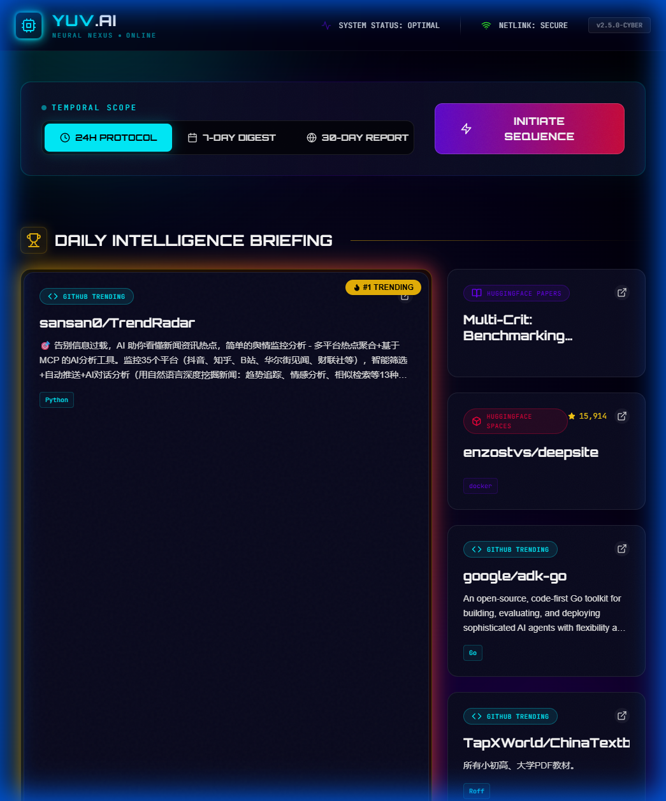
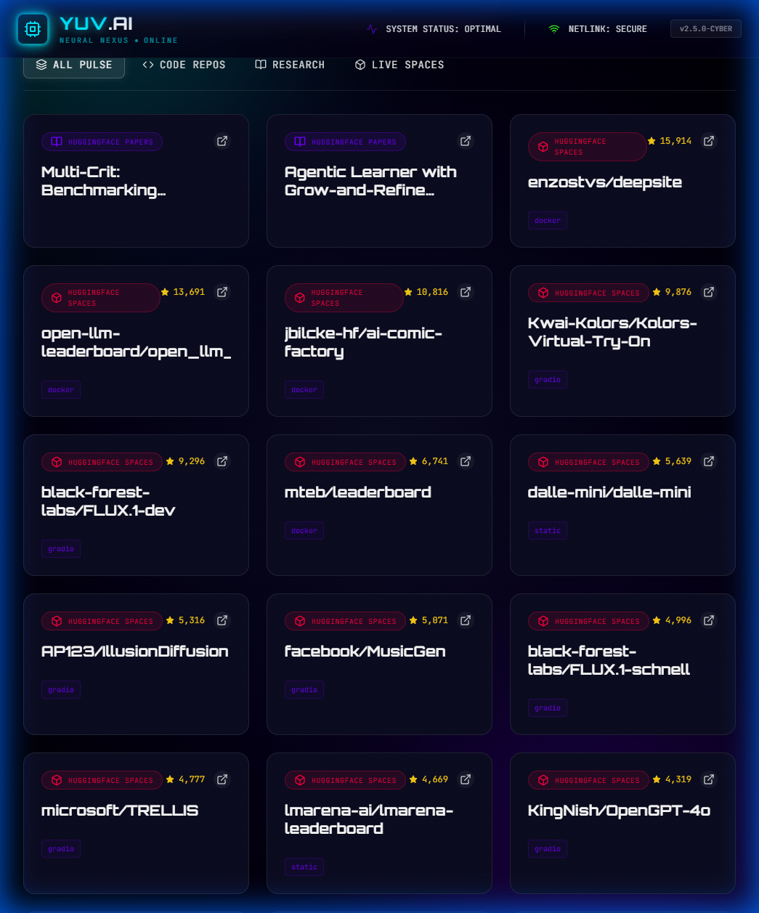
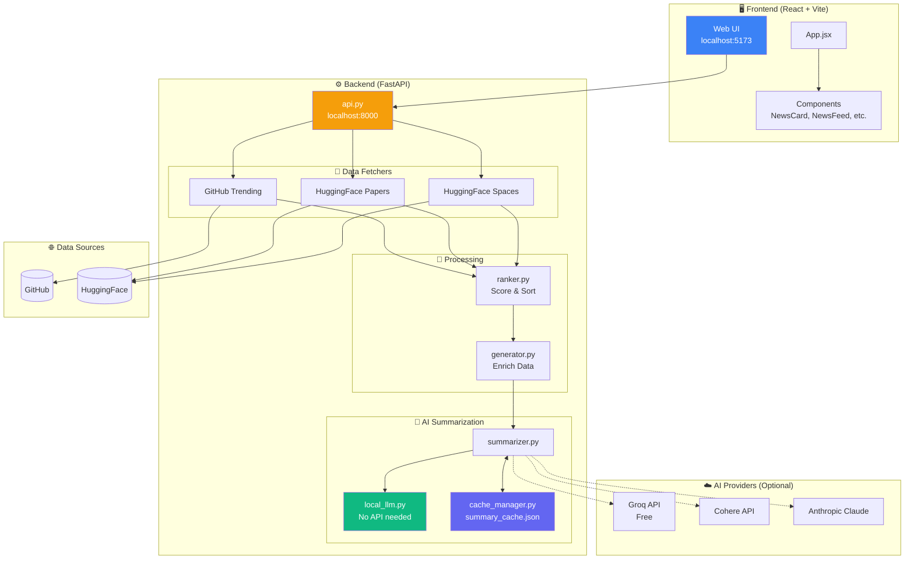

# 🤖 YUV.AI Developers AI Trends

> **Your personal AI news assistant - get the latest AI/ML trends with smart summaries, no API key required!**

A news aggregator that fetches trending AI content from GitHub and Hugging Face, then explains what each project does using AI. Works out-of-the-box with a built-in local summarizer, or connect your favorite AI provider for enhanced summaries.


---

## 📋 Release Notes (v2.0.0)

### 🆕 What's New

- **No API Key Required!** - New `local_wasm` mode generates summaries without any external API
- **Smart Caching** - Summaries are cached locally, auto-cleans invalid entries
- **4 AI Providers** - Choose from Local, Groq (free), Cohere, or Anthropic Claude
- **Better Fallbacks** - Automatically falls back to local mode if API fails or rate-limits
- **Improved Metadata** - Better summaries for items without descriptions (HuggingFace Spaces)
- **New API Endpoints** - `/api/populate-summaries`, `/api/cache-stats`, `/api/check-summaries`

### 🐛 Bug Fixes

- Fixed empty "What" fields in AI summaries
- Fixed cache returning invalid entries
- Improved error handling for rate limits

---

## 📸 Screenshots

### Main Interface


### Content Filtering


---

## 🏗️ Architecture



---

## 🔌 API Reference

The backend runs on `http://localhost:8000`

### Core Endpoints

| Method | Endpoint | Description |
|--------|----------|-------------|
| `POST` | `/api/generate` | Fetch and return trending AI content |
| `GET` | `/api/settings` | Get current LLM provider settings |
| `POST` | `/api/settings/provider` | Change active AI provider |
| `POST` | `/api/settings/api-key` | Save an API key |
| `DELETE` | `/api/settings/api-key/{provider}` | Remove an API key |

### Summary Endpoints

| Method | Endpoint | Description |
|--------|----------|-------------|
| `POST` | `/api/populate-summaries` | Generate summaries for items |
| `POST` | `/api/check-summaries` | Check which items need summaries |
| `GET` | `/api/cache-stats` | Get cache statistics |

### Request Examples

**Generate Content:**
```bash
curl -X POST http://localhost:8000/api/generate \
  -H "Content-Type: application/json" \
  -d '{"time_range": "daily", "limit": 50, "disable_ai": false}'
```

**Populate Summaries:**
```bash
curl -X POST http://localhost:8000/api/populate-summaries \
  -H "Content-Type: application/json" \
  -d '{"items": [...], "force_refresh": false}'
```

**Change Provider:**
```bash
curl -X POST http://localhost:8000/api/settings/provider \
  -H "Content-Type: application/json" \
  -d '{"provider": "groq", "model": "llama-3.3-70b-versatile"}'
```

---

## 🚀 Quick Start (5 Minutes)

### What You Need
- Python 3.8 or higher
- Node.js (for the web interface)

### Step 1: Download the Project

```bash
git clone https://github.com/hoodini/yuv-ai-trends.git
cd yuv-ai-trends
```

### Step 2: Set Up Python Environment

```bash
# Create a virtual environment (keeps things clean)
python -m venv .venv

# Activate it:
# On Windows:
.venv\Scripts\activate
# On Mac/Linux:
source .venv/bin/activate

# Install Python packages
pip install -r requirements.txt
```

### Step 3: Set Up the Web Interface

```bash
cd ui
npm install
cd ..
```

### Step 4: Create Your Settings File

Create a file called `.env` in the main folder:

```bash
# Copy this into your .env file:
LLM_PROVIDER=local_wasm
```

That's it! The app will use the built-in summarizer - no API key needed.

### Step 5: Start the App

**Option A: Use the startup script (Recommended)**
```powershell
# On Windows:
.\start_app.ps1
```

**Option B: Start manually**
```bash
# Terminal 1 - Start the backend:
python api.py

# Terminal 2 - Start the frontend:
cd ui
npm run dev
```

### Step 6: Open the App

Go to `http://localhost:5173` in your browser and click "Generate" to fetch the latest trends!

---

## 🤖 AI Summary Options

The app generates summaries explaining **What** each project does, what problem it **Solves**, and **How** it works.

### Option 1: Local Mode (Default - No API Key Needed)

Works immediately! Uses smart keyword analysis to generate summaries from project metadata.

```bash
# In your .env file:
LLM_PROVIDER=local_wasm
```

**Best for:** Quick setup, privacy-focused users, offline use

### Option 2: Groq (Free & Fast)

Get a free API key from [console.groq.com](https://console.groq.com) - it's instant and free!

```bash
# In your .env file:
LLM_PROVIDER=groq
GROQ_API_KEY=your_key_here
```

**Best for:** High-quality summaries at no cost

### Option 3: Cohere (Free Tier Available)

Sign up at [dashboard.cohere.com](https://dashboard.cohere.com)

```bash
# In your .env file:
LLM_PROVIDER=cohere
COHERE_API_KEY=your_key_here
```

**Best for:** Production use, reliable API

### Option 4: Anthropic Claude (Highest Quality)

Get an API key from [console.anthropic.com](https://console.anthropic.com)

```bash
# In your .env file:
LLM_PROVIDER=anthropic
ANTHROPIC_API_KEY=your_key_here
```

**Best for:** Most detailed and accurate summaries

---

## 📊 What Data Does It Fetch?

The app collects trending content from:

| Source | What It Gets | Examples |
|--------|--------------|----------|
| **GitHub Trending** | Hot repositories | Stars, language, topics, daily growth |
| **HuggingFace Papers** | AI research papers | Titles, authors, upvotes |
| **HuggingFace Spaces** | ML demos & apps | Likes, SDK used, creator |

---

## ⚙️ Configuration Options

### Time Range

Choose how far back to look for trends:

```bash
# In the web UI, select:
# - 24H PROTOCOL (daily)
# - 7-DAY DIGEST (weekly)
# - 30-DAY REPORT (monthly)
```

### Customize in config.py

```python
# Which programming languages to track
GITHUB_LANGUAGES = ["python", "jupyter-notebook", "typescript"]

# How many items to show
HF_SPACES_TRENDING_LIMIT = 20

# How items are ranked (must add up to 1.0)
SCORING_WEIGHTS = {
    "stars_weight": 0.4,      # Popularity (stars/likes)
    "recency_weight": 0.3,    # How new it is
    "velocity_weight": 0.3,   # How fast it's growing
}
```

---

## 🔧 Troubleshooting

### "Port 8000 already in use"

Another program is using that port. Find and stop it:

```powershell
# On Windows:
netstat -ano | findstr :8000
taskkill /PID <the_number_you_see> /F
```

### "No summaries showing"

1. Check your `.env` file exists and has `LLM_PROVIDER=local_wasm`
2. Restart the backend: `python api.py`
3. Try generating again

### "API rate limit error"

If using Groq/Cohere/Anthropic:
- Wait a minute and try again
- Switch to `local_wasm` mode as fallback
- The app automatically falls back to local mode if API fails

### Summaries show "Details not available"

This happens when:
- The project has no description on GitHub/HuggingFace
- The cache has old data

**Fix:** The app auto-cleans bad cache entries. Just generate again.

---

## 📁 Project Files Explained

```
yuv-ai-trends/
├── api.py              # Backend server (handles data fetching)
├── main.py             # Command-line version
├── config.py           # Settings (languages, limits, weights)
├── fetchers.py         # Gets data from GitHub & HuggingFace
├── ranker.py           # Scores and sorts items
├── generator.py        # Creates the output
├── summarizer.py       # AI summary generation
├── local_llm.py        # Built-in summarizer (no API needed)
├── cache_manager.py    # Saves summaries to avoid re-processing
├── .env                # Your settings (create this yourself)
├── summary_cache.json  # Saved summaries (auto-generated)
├── ui/                 # Web interface (React)
│   ├── src/
│   │   ├── App.jsx     # Main app component
│   │   └── components/ # UI pieces
│   └── package.json    # Node.js dependencies
└── start_app.ps1       # One-click startup script
```

---

## 🖥️ Command-Line Usage (Optional)

Don't need the web UI? Use the command line:

```bash
# Generate a daily digest and open in browser
python main.py --range daily --open

# Weekly digest, limit to 30 items
python main.py --range weekly --limit 30

# Skip AI summaries
python main.py --range daily --no-ai

# Save to specific file
python main.py --range daily --output my_digest.html
```

---

## 🤝 Contributing

Found a bug? Have an idea? Contributions welcome!

1. Fork the repository
2. Create your feature branch
3. Make your changes
4. Submit a pull request

---

## 📝 License

MIT License - use it however you want!

---

## 👤 Author

**Yuval Avidani** - [YUV.AI](https://yuv.ai)

---

**Made with ❤️ for the AI/ML community**
